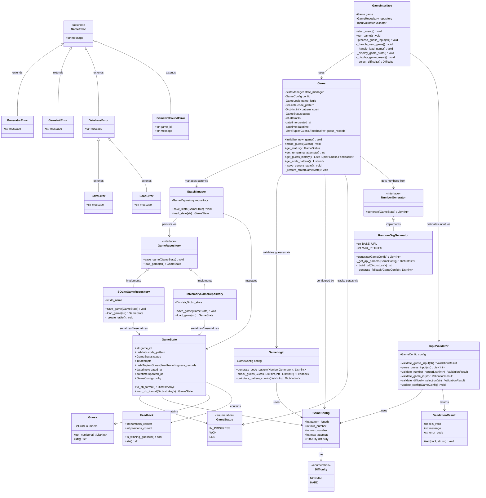

# Mastermind
A Python implementation of the classic code-breaking game with Random.org API integration.

## Getting Started
### Prerequisites
- Python 3.8+
- pip (Python package installer)

### Installation & Setup

1. Clone the repositor
    ```
    git clone https://github.com/amandayclee/mastermind.git
    cd mastermind
    ```

2. (Optional) Install `virtualenv` for virtual environment management
    ```
    pip install virtualenv
    ```

2. Set up virtual environment
    ```
    python -m venv venv
    ```

3. Activate virtual environment
    #### On Windows:
    ```
    venv\Scripts\activate
    ```
    #### On macOS/Linux:
    ```
    source venv/bin/activate
    ```

4. Install dependencies
    ```
    pip install -r requirements.txt
    ```

5. Run the game
    ```
    python main.py
    ```

6. View the game's test reports
    ```
    pytest
    ```

7. View the game's documentation using `pydoc`
    ```
    python -m pydoc -b
    ```

## Game Structure


## Thought Process for Mastermind  Development

### Initial Approach and Design Principles
After carefully analyzing the challenge, I identified key engineering principles to guide the development:

1. Clean Architecture and SOLID Principles
    - Applied single responsibility principle for clear component boundaries
    - Separated concerns into specialized modules for better organization
    - System Reliability and Error Handling

2. Implemented comprehensive error handling for expected/unexpected failures
    - Created custom exceptions for clear error identification
    - Added resilience mechanisms for external API dependencies

3. Security and Validation
    - Added input validation to protect against invalid/malicious inputs
    - Created logging system for monitoring and debugging

### Core Requirements Analysis
I broke down the requirements into two main categories:
1. Essential Game Mechanics:
    - Generate a secret 4-digit code using numbers 0-7
    - Allow players 10 attempts to guess correctly
    - Provide feedback after each guess
    - Track game state and determine win/loss conditions

2. Technical Integration:
    - Integrate with Random.org API for number generation

### Iterative Development Process
#### First Iteration - MVP
- Implemented core game logic and basic validation
- Created simple command-line interface
- Added fundamental error handling
- Wrote initial test cases for core functionality

#### Second Iteration - Architecture Refinement
- `core/`: Separated number generation from game logic
- `interface/`: Built clean CLI focusing on user interaction
- `models/`: Simplified design by removing unnecessary player class
- `utils/`: Added custom exceptions and logging infrastructure

#### Third Iteration - Code Quality
- Enhanced code readability with type hints
- Implemented comprehensive logging system
- Added thorough documentation and comments
- Improved game state management for better control flow

#### Fourth Iteration - Persistence and Scaling
- Designed repository pattern for flexible storage
- Implemented SQLite integration for persistence
- Updated test suite for new components
- Enhanced error handling for database operations

#### Fifth Iteration - Architecture Refinement
- `core/`: 
    - Moved `config/` from root to core for better organization
    - Moved `models/` from root to core, as the game state, feedback, and guess objects are essential parts of the game's business logic
- `interface/`: Kept interfaces separate from core because they represent how users interact with our game. This separation allows for adding new interfaces (like a web API) without modifying the core game logic
- `repository/`: Kept the repository as a separate top-level folder instead of placing it in core or services, as it represents our data persistence abstractions. The repository pattern acts as a bridge between our domain model and data mapping layers
- `services/`:
    - Moved `generators/` from core to services, as it represents an external dependency
    - Moved `exceptions/` from utils to services for better organization
- `utils/`: Added a validator utility for input validation and data integrity
- `tests/`: Updated the test suite to cover the new architectural changes and ensure the game's functionality remains intact after the refactoring process

## Future Considerations
- [ ] Add suppot to give hint
- [x] Add a configurable "difficulty level" and adjust the numbers that are used
- [ ] Extend to multi-player
- [ ] Keep track of scores
- [ ] Add a timer for the entire game, or each guess attempts
- [x] Develop an event logging system to enhance the development experience
- [x] Enable persistent game storage to allow users to restore their games after exiting the application
- [ ] Design and implement API endpoints to enable seamless integration with a frontend user interface